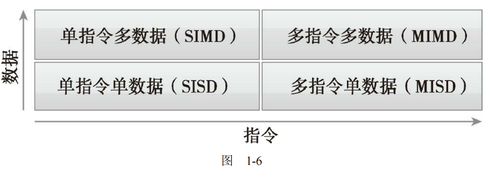
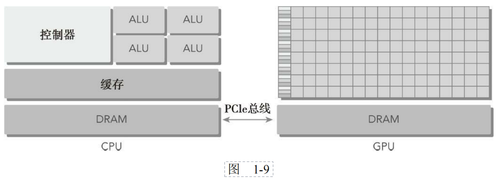

 

# CUDA 编程

## 计算机架构

有多种不同的方法可以对计算机架构进行分类。一个广泛使用的分类方法是弗林分类法（Flynn’s Taxonomy），它根据指令和数据进入CPU的方式，将计算机架构分为4种不同的类型（如图1-6所示）。

- SISD指的是传统计算机：一种串行架构。在这种计算机上只有一个核心。在任何时间点上只有一个指令流在处理一个数据流。

- SIMD是一种并行架构类型。在这种计算机上有多个核心。在任何时间点上所有的核心只有一个指令流处理不同的数据流。向量机是一种典型的SIMD类型的计算机，现在大多数计算机都采用了SIMD架构。SIMD最大的优势或许就是，在CPU上编写代码时，程序员可以继续按串行逻辑思考但对并行数据操作实现并行加速，而其他细节则由编译器来负责。

- MISD类架构比较少见，在这种架构中，每个核心通过使用多个指令流处理同一个数据流。

- MIMD是一种并行架构，在这种架构中，多个核心使用多个指令流来异步处理多个数据流，从而实现空间上的并行性。许多MIMD架构还包括SIMD执行的子组件。

GPU代表了一种众核架构，几乎包括了前文描述的所有并行结构：多线程、MIMD（多指令多数据）、SIMD（单指令多数据），以及指令级并行。NVIDIA公司称这种架构为SIMT（单指令多线程）。

#### GPU核心和CPU核心

尽管可以使用多核和众核来区分CPU和GPU的架构，但这两种核心是完全不同的。

CPU核心比较重，用来处理非常复杂的控制逻辑，以优化串行程序执行。

GPU核心较轻，用于优化具有简单控制逻辑的数据并行任务，注重并行程序的吞吐量。

## 异构架构

一个典型的异构计算节点包括两个多核CPU插槽和两个或更多个的众核GPU。GPU不是一个独立运行的平台而是CPU的协处理器。因此，GPU必须通过PCIe总线与基于CPU的主机相连来进行操作，如图1-9所示。这就是为什么CPU所在的位置被称作主机端而GPU 所在的位置被称作设备端。

上图中的ALU指算术逻辑单元，它是CPU的一个重要组成部分。ALU负责执行各种算术和逻辑操作，包括加法、减法、乘法、除法、位运算等。